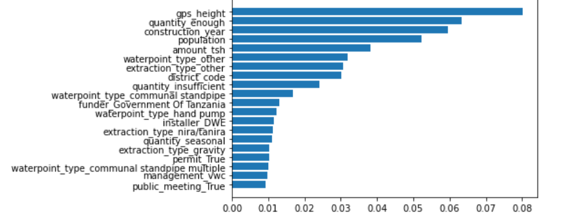

# Tanzanian-water-point-classification

This projects objective is to see if we can create a model that can classify Tanzanian water points correctly with a threshold of 60%.

To see the results from this analysis run the "water point classification file" in main folder

we say that the best performing model was random forest,  with a 4 cross validated test score of 82%, best parameters

criterion=entropy​

n_estimators=500​

min_samples_split=5

We can also see that the best metrics from our analysis at determining if the wells were good are

-GPS height
-is their enough water, quantity
-the year built
-population size
-amount of water to be pulled
